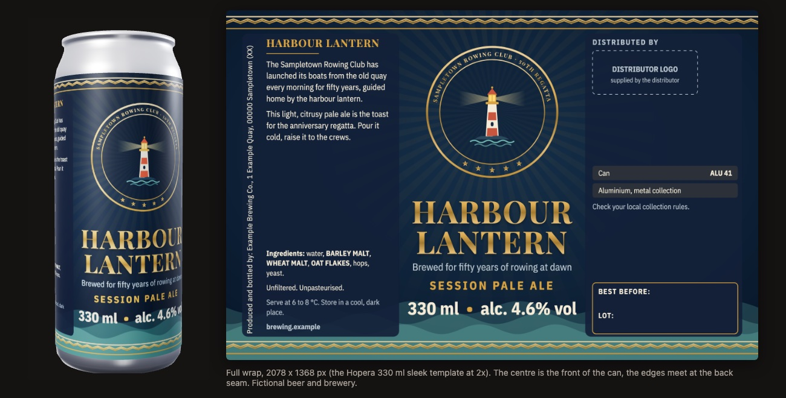
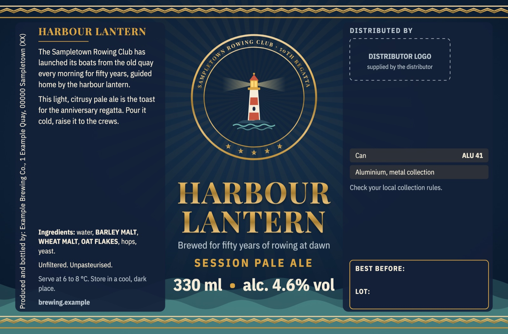
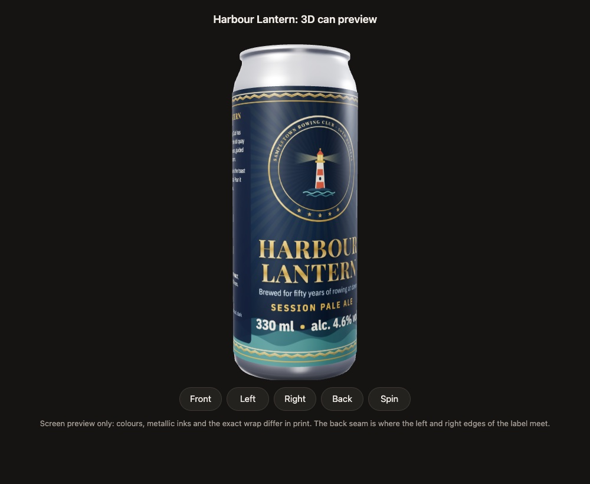
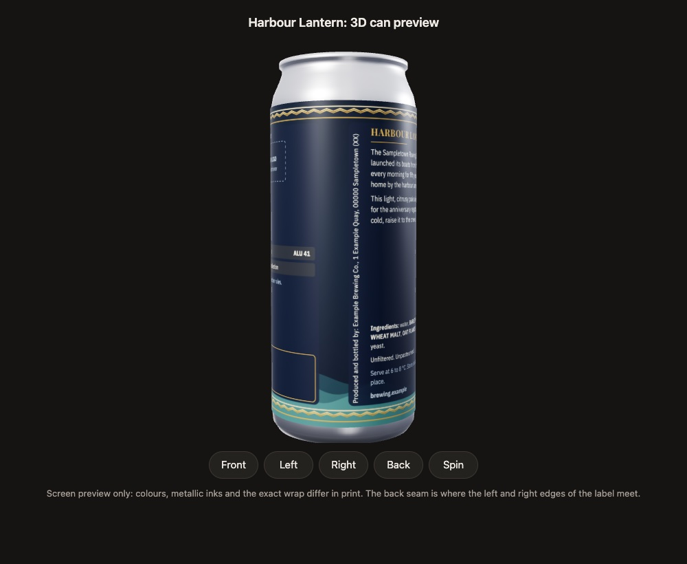

# beer-can-label

A Claude Code skill that designs a print-ready **full-wrap beer can label** and previews it on a **rotating 3D can**. The default template is Hopera's 330 ml sleek can (2078 x 1368 px); custom can sizes work too.



> **Independent project.** This skill is not affiliated with, sponsored by or endorsed by Hopera. "Hopera" is used only to name the can template the skill targets. Verify the template with Hopera before printing.

## What it does

- Interviews you first: beer, occasion and mood, colours, logos, mandatory text, language, template.
- Proposes two or three concept directions in words, you pick one.
- Writes a `spec.json` and builds:
  - `label.svg`: vector artwork,
  - `label.png`: exact template size (2x the Hopera minimum), rendered with headless Chrome using the real web fonts,
  - `can_preview.html`: a three.js 3D can with Front / Left / Right / Back / Spin buttons and drag to rotate.
- Lays out the wrap the way cans work: front third for name, style, volume and ABV; side panels for story, ingredients with **emphasised allergens**, "Distributed by" placeholder, recycling table and an empty best-before box; a vertical producer line; nothing in the back-seam safe zone.
- Runs a QA pass: size and ratio, required elements, minimum text size in mm, WCAG contrast, seam and margin zones, field of vision, em dashes, open placeholders.
- Hands over the files, the Hopera upload steps and the list of things still to confirm.

Motif library: sunburst, laurel wreath, roundel with ring text, hop cone, Greek key band, zigzag band, waves, mountains (bands and scenery repeat without a visible join at the back seam). Six built-in palettes, any two Google Fonts.

## The intake questions

Claude asks only what you have not already said, in your language, in at most two rounds:

1. Beer name and style
2. ABV and volume (default 330 ml sleek)
3. Who it is for, the occasion, the mood
4. Colours and fonts, or "surprise me"
5. Logo files (SVG or PNG/JPEG)
6. Imagery motif
7. Required text: producer name and address, ingredients, allergens, extra claims
8. Label language(s)
9. Template: Hopera (default) or custom size
10. Print notes: metallic ink, white underprint
11. Deliverables

Anything unknown stays `TBC` and is listed at the end. Details and defaults: [references/intake.md](references/intake.md).

## Install

```bash
git clone https://github.com/Matteoikarieth96/beer-can-label-skill ~/.claude/skills/beer-can-label
```

Requirements:

- Python 3.9 or newer (standard library only).
- Google Chrome or Chromium for the PNG and the 3D snapshots (macOS app path, `google-chrome`/`chromium` on PATH, or `CHROME_PATH`). Without it you still get the SVG and the 3D preview.
- Network access is optional but recommended: the render loads the two fonts from Google Fonts, and the 3D preview loads three.js r128 from cdnjs (with a flat-label fallback when offline).

## Usage

In Claude Code, just ask:

> Design a label for our beer: a session pale ale for our rowing club's 50th regatta, navy and brass, here is our logo.

> Fammi l'etichetta per la lattina della nostra birra, formato Hopera.

Or run the scripts yourself:

```bash
cp templates/spec.template.json my-beer/spec.json      # then edit it
python3 scripts/build_label.py my-beer/spec.json -o my-beer/out
python3 scripts/check_label.py my-beer/spec.json my-beer/out/label.svg
python3 scripts/snapshot_can.py my-beer/out/can_preview.html -o my-beer/out/can_front.png --view three-quarter
```

Every spec field is described in [references/spec-format.md](references/spec-format.md).

## Outputs

| File | Use |
|---|---|
| `label.png` | Exact template size (Hopera: 2078 x 1368 px). Upload this to Hopera's previewer and send it to the printer |
| `label.svg` | Vector artwork; web fonts referenced from Google Fonts (outline them if the printer asks) |
| `label.html` | The SVG with its fonts, used for rendering |
| `can_preview.html` | Self-contained 3D can; works from disk, shows the flat label if WebGL or the CDN is missing |
| QA report | `check_label.py` output: errors to fix, warnings to discuss, open placeholders |

## Upload to Hopera's previewer

1. Run the QA until it reports 0 errors.
2. Open <https://hopera.xyz/labelPreview>.
3. In "Add your design", choose `label.png` (2078 x 1368 px).
4. Rotate the can: name in front, panels readable when turned, nothing cut at the back seam.
5. Send the files to Hopera through the channel they gave you and ask about colour profile, outlined fonts, bleed, white underprint and metallic inks.

The skill never uploads files or submits forms for you. More in [references/hopera-template.md](references/hopera-template.md).

## Example (fictional)

[examples/fictional](examples/fictional) is a complete run for an invented beer ("Harbour Lantern" by "Example Brewing Co." of "Sampletown"): spec, logo, built SVG, PNG and 3D preview. Every name, place and number in it is fictional.

| Flat wrap | 3D front | Back seam |
|---|---|---|
|  |  |  |

## Labelling

[references/labelling-checklist.md](references/labelling-checklist.md) lists the EU (Regulation (EU) 1169/2011, Directive 2011/91/EU) and Italian items (Italian language, plant address, environmental labelling under D.Lgs. 116/2020 such as ALU 41) with sources and what could not be verified. **It is not legal advice:** the producer confirms the mandatory text.

## Security

Logos, spec text and file paths are treated as untrusted. Text is escaped; SVG logos are sanitized (scripts, event handlers, `foreignObject`, external references and entity declarations removed or refused) and embedded as images, never inlined; logo paths must stay inside the spec folder; font names are whitelisted; Chrome runs with a throwaway profile and argument lists; three.js is pinned with Subresource Integrity. Details and residual risks: [SECURITY.md](SECURITY.md).

## Limitations

- The QA is a design aid with heuristics (text boxes, an assumed x-height ratio, contrast against flat colours). It does not certify compliance.
- Colours are sRGB on screen. There is no CMYK or PDF export; ask your printer how they want the files. The SVG references Google Fonts, so convert text to outlines in a vector editor if the printer asks.
- Without Chrome, line widths are estimated and the PNG is not produced.
- The 3D can is a generic sleek-can shape with simplified lighting; metallic inks and the real seam position differ in print.
- Built-in label strings exist for English and Italian; other languages use the `strings` overrides.
- Motifs are stylised and parametric, not illustrations. For a custom illustration, supply it as the logo.
- Hopera's template facts can change: check them with Hopera.

## Tests

```bash
python3 -m unittest discover -s tests -v
```

The suite covers spec validation, text and markup injection, malicious SVG logos, path traversal, font names and the QA checks. CI runs it on every push and pull request.

## More skills

- [evm-dd](https://github.com/Matteoikarieth96/evm-dd-skill): investor-angle due diligence on crypto and EVM projects, with a scored report and an A4 one-pager
- [hiring-prep](https://github.com/Matteoikarieth96/hiring-prep-skill): an interview prep page from a company, a role and your resume, with an interactive test
- [3d-print-design](https://github.com/Matteoikarieth96/3d-print-design-skill): parametric parts for FDM 3D printing, checked before export
- [whiteboard-video](https://github.com/Matteoikarieth96/whiteboard-video-skill): hand-drawn whiteboard explainer videos with voice-over

## Licence

MIT, see [LICENSE](LICENSE).
